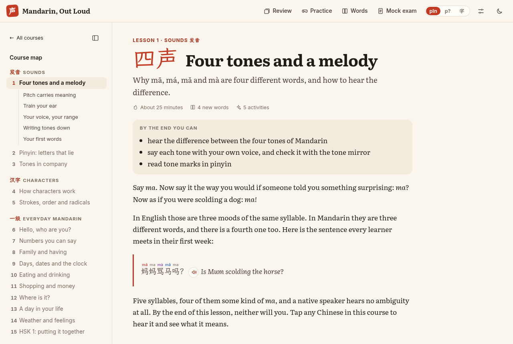

# Mandarin, Out Loud

An interactive Mandarin course from your first tone to HSK 2: 23 lessons in four parts, from
sounds and characters through to the HSK 2 grammar. Around them sit a spaced-repetition review
deck, a practice arcade, a word list, mock exams and a placement check.



## What's in it

- **Lessons** (`content/lessons/*.md`): Markdown. Any Chinese gets pinyin (shown according to the
  learner's *scaffolding dial*: always, on tap, or off), tone colours, audio and a word card.
  Activities include dialogues with a shadowing mode, scripted scenes, graded stories, sentence
  builders, tone and pinyin drills, writing with stroke order, and the tone mirror.
- **Tone mirror**: records the learner, tracks pitch in the browser (YIN), draws the contour over
  the target tone shapes and names the tone it heard, by comparing the contour with 300 recorded
  syllables in four voices plus textbook shapes. It only gives a verdict when it is confident
  (right about 93% of the time on unseen voices) and says so when it is not. Recordings never
  leave the device.
- **Review deck**: FSRS spaced repetition (ts-fsrs) with reading, listening and speaking cards.
  Finishing a lesson adds its words.
- **Practice**: word blitz, tone detective, tone pairs, number drills (numbers, prices, times,
  dates, phone numbers), measure words, writing, the town map, the family tree, the character
  builder and the pinyin chart.
- **Mock exams** in HSK 1 and 2 formats, a **placement check**, and a **word list** of every
  HSK 1–3 word in three syllabuses (2025, 2021 "HSK 3.0" and HSK 2.0).
- **Optional AI partner**: role-plays and sentence feedback use Claude with the learner's own
  Anthropic API key (kept in their browser). The course is complete without it.

Every word of the 2025 HSK 1 and 2 syllabus is taught in some lesson; `content/coverage.test.ts`
enforces this.

## Develop

```sh
npm ci
npm run dev        # http://localhost:5173
npm test           # library, content, coverage and exam tests
npm run check      # svelte-check
npm run build      # static site in dist/
```

Progress, settings and the review deck live in the learner's browser (`localStorage`), with
export and import in Settings.

## Audio

Clips are recorded with OpenAI text-to-speech and kept out of git: they are published as one
zip on a GitHub release, named with its checksum in `audio-release.json`. The deploy workflow
runs `npm run audio:fetch` to unpack it into `static/audio/` before building, so the site serves
every clip itself. Without the clips, the course uses the browser's own Chinese voice.

```sh
npm run audio:fetch                      # download the published clips for local development
```

To record new audio after changing content:

```sh
npm run audio:texts                      # list every text the course speaks -> static/audio/texts.json
npm run audio -- --env path/to/.env      # record what is missing -> static/audio/*.mp3, manifest.json
npm run audio:pack -- --tag mandarin-audio-v2
gh release create mandarin-audio-v2 build/mandarin-audio.zip --title "Mandarin course audio"
git commit audio-release.json            # the deploy picks up the new release
```

The recorder reads `OPENAI_API_KEY` from the environment or a `.env` file (`--env`, else `./.env`,
the repository's `.env`, or a `.env` in the folder containing the repository); behind a proxy
that adds the credential itself, run it with `NODE_USE_ENV_PROXY=1`. Without `--model` it picks
the newest steerable speech model the API lists (`gpt-*-tts`). Options: `--voice coral`,
`--tiers words,lessons,extras`, `--limit N`, `--concurrency N`, `--no-verify`, `--dry-run`. It
only records clips that are missing, so it can be stopped and resumed (run `npm run audio:fetch`
first to start from the published set).

Every clip is trimmed of silence and re-encoded as mono 40 kbps MP3 (with ffmpeg), then checked:
it is transcribed and compared with the expected reading, and single syllables go through the
course's tone classifier. Failures are retried; short clips with the wrong words are left to the
browser voice, and anything doubtful is listed in `static/audio/qa.json` for a human to check.
About 2,750 clips cover every word card, review card, lesson, exam and widget; text generated on
the fly (number drills, the town map) uses the browser voice.

## Regenerating derived data

After adding lessons with new characters or words:

```sh
sh scripts/refresh.sh path/to/complete.json path/to/LXGWWenKai-Regular.ttf
```

This rebuilds the dictionary (`content/data/lexicon.json`, `chars.json`) from the
[Complete HSK Vocabulary](https://github.com/drkameleon/complete-hsk-vocabulary) dataset, copies
stroke data for every character, and subsets the LXGW WenKai font to the characters in use.
`npm test` reports any character that lacks a reading, a glyph or stroke data.

## Credits and licences

- Vocabulary: Complete HSK Vocabulary (MIT), with definitions from CC-CEDICT (CC BY-SA 4.0);
  learner glosses in `content/data/extra.ts`.
- Stroke data: hanzi-writer-data, derived from Make Me a Hanzi (Arphic Public License,
  `static/strokes/LICENSE`); animation and quizzes by hanzi-writer (MIT).
- Font: LXGW WenKai (SIL Open Font License 1.1, `src/lib/assets/fonts/OFL.txt`), subset.
- Pinyin for characters outside the word lists: pinyin-pro (MIT), at build time.

See `docs/AUTHORING.md` for the lesson format.
